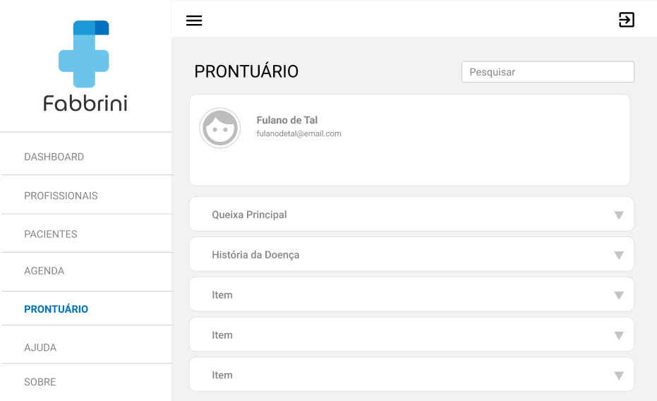

 
    <a href="https://github.com/MatheusXG/FabbriniProntuario"></img></a>

    <a target="_blank" rel="noopener noreferrer" href="https://img.shields.io/badge/license-MIT-%236ac4eb">
        </img>
    </a>
    <a target="_blank" rel="noopener noreferrer" href="https://img.shields.io/badge/prontuario-welcome-6ac4eb">
        </img>
    </a>

 
<h1>
    <a href="https://github.com/MatheusXG/FabbriniProntuario"></img></a>
</h1>
<!-- 

    <a href="https://pt-br.reactjs.org/">Tecnologias</a>
    &nbsp;&nbsp;&nbsp;|&nbsp;&nbsp;&nbsp;   
    <a href="https://pt-br.reactjs.org/">Projeto</a>
    &nbsp;&nbsp;&nbsp;|&nbsp;&nbsp;&nbsp;   
    <a href="https://pt-br.reactjs.org/">Layout</a>
     &nbsp;&nbsp;&nbsp;|&nbsp;&nbsp;&nbsp;   
    <a href="https://pt-br.reactjs.org/">Licença</a>    

 -->
 
<h1 align="left" style="font-family: Segoe UI; font-weight: bold; font-size:24px">🛰️ Tecnologias</h1>

Esse projeto foi desenvolvido com as seguintes tecnologias:

<ul>
    <li><a style="font-family: Segoe UI; font-size: 17px; "href="https://pt-br.reactjs.org/">React</a></li>
    <li><a style="font-family: Segoe UI; font-size: 17px"href="https://www.mongodb.com/pt-br">MongoDB</a></li>
    <li><a style="font-family: Segoe UI; font-size: 17px"href="https://nodejs.org/pt-br/">NodeJS</a></li>
    <li><a style="font-family: Segoe UI; font-size: 17px"href="https://expressjs.com/pt-br/">ExpressJS</a></li>
    <li><a style="font-family: Segoe UI; font-size: 17px"href="https://developer.mozilla.org/pt-BR/docs/Web/JavaScript">Javascript</a></li>
</ul>
 

<h1 align="left" style="font-family: Segoe UI; font-weight: bold; font-size:24px">🖥️ Projeto</h1>

O prontuário eletrônico é uma nova ferramenta do ecossistema Fabbrini, que vai ajudar os médicos, enfermeiros e profissionais de saúde com o preenchimento e armazenamento de informações médicas sobre o paciente, que poderão ser consultadas tanto por um profissional da saúde.

 

<h1 align="left" style="font-family: Segoe UI; font-weight: bold; font-size:24px">📐 Layout</h1>

Você pode visualizar o layout do projeto através desse <a href="https://www.figma.com/file/xLWjRMKi0ehRx6hxbkZC3f/Fabbrini?node-id=0%3A1">link</a>. É necessário ter conta no <a href="https://www.figma.com">Figma</a> para acessá-lo.

 

<h1 align="left" style="font-family: Segoe UI; font-weight: bold; font-size:24px">🚀 Como executar</h1>

Clone o projeto e acesse a pasta do mesmo.

<pre align="left" style="font-family: Consolas; font-size: regular; ">
$ git clone https://github.com/MatheusXG/FabbriniProntuario.git
$ <code style="color: #79C0FF" >cd</code> FabbriniProntuario
</pre>

Para iniciar o frontend da aplicação, siga os passos abaixo:

<ul>
    <li style="font-family: Segoe UI; font-size: 16px" >Entre na pasta do frontend da aplicação: <code style="background: #373C43; border-radius: 15px;">cd web</code></li>
    <li style="font-family: Segoe UI; font-size: 16px" >Instale as depêndencias com: <code style="background: #373C43; border-radius: 15px;">npm install</code> ou <code style="background: #373C43; border-radius: 15px;">yarn install</code></li>
    <li style="font-family: Segoe UI; font-size: 16px" >Execute o frontend com: <code style="background: #373C43; border-radius: 15px;">npm start</code> ou <code style="background: #373C43; border-radius: 15px;">yarn start</code></li>
</ul>
 

Para iniciar o backend da aplicação, siga os passos abaixo:

<ul>
    <li style="font-family: Segoe UI; font-size: 16px" >Entre na pasta do backend da aplicação: <code style="background: #373C43; border-radius: 15px;">cd backend</code></li>
    <li style="font-family: Segoe UI; font-size: 16px" >Instale as depêndencias com: <code style="background: #373C43; border-radius: 15px;">npm install</code> ou <code style="background: #373C43; border-radius: 15px;">yarn install</code></li>
    <li style="font-family: Segoe UI; font-size: 16px" >Execute o backend com: <code style="background: #373C43; border-radius: 15px;">npm start</code> ou <code style="background: #373C43; border-radius: 15px;">yarn start</code></li>
</ul>
 

<h1 align="left" style="font-family: Segoe UI; font-weight: bold; font-size:24px">📍 Plano de Projeto</h1>

O Plano deste projeto pode ser acessado através deste <a href="https://1drv.ms/p/s!AiZM-A7PdJA4xTVJ9XZIj9EqJPWu?e=tzl9rc">link</a> para mais detalhes.

 

<h1 align="left" style="font-family: Segoe UI; font-weight: bold; font-size:24px">📄 Licença</h1>

Esse projeto está sob a licença MIT. Veja o arquivo <a href="https://github.com/MatheusXG/FabbriniProntuario/blob/main/LICENSE.md">LICENSE</a> para mais detalhes.

 

<h1 align="left" style="font-family: Segoe UI; font-weight: bold; font-size:24px">🧑‍💻 Developers</h1>
<ul>
    <li style="font-family: Segoe UI; font-size: 20px" >👨🏼‍💻 Matheus Xavier Godois</li>
    
<a href="https://github.com/MatheusXG/">🔥 github</a>

     <li style="font-family: Segoe UI; font-size: 20px" >👨🏼‍💻 Gabriel Aragão Amaral</li>
    
<a href="https://br.linkedin.com/in/gabriel-arag%C3%A3o-038779163?trk=people-guest_people_search-card">📧 linkedin</a>

</ul>